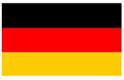

# DAT100: Java Programmering 1 - uke 35

## Uttrykk - innlesing og utskrift

Formålet med denne programmeringslab er å bli bedre kjent med Java utviklingsmiljøet, dvs. skrive, lagre, kompilere, kjøre og rette feil i enkle Java-programmer. Egen PC brukes til utvikling av Java programmene.

Vi skal i første omgang lage enkle Java-programmer som bare inneholder en enkelt `main()`– metode som utfører det vi vil ha gjort. Vi skriver programmene ved bruk av Eclipse og man kan eksempelvis opprette et nytt Eclipse prosjekt med navn `DAT100Lab1` for denne programmeringslab og legge de java-filer som utvikles som en del av dette prosjektet.

### Gjennomføring

I alle oppgavene er det meningen at dere skal jobbe på egen hånd men det er lov å diskutere og hjelpe hverandre. Dette gir den beste læringseffekten og gjør det lettere å komme gjennom alle oppgavene. Arbeidsmengden på oppgavene vil for noen være mer enn de timene som er satt av til programmerings-lab på timeplanen.

Undervisere og lab-assistenter er til stede på labbene slik dere kan få hjelp til det dere står fast på.

### Oppgave 1

Lag et program som leser inn to heltall fra brukeren og skriver ut summen av de. Modifiser programmet slik det kan beregne areal av et rektangel der lengden og bredden på rektangelet leses inn fra brukeren.

### Oppgave 2

**Oppgave 6 Kap. 2 i Java-boken:** Metoden `min` i klassen `Math` finner det minste av to tall dvs. `min(1,10) = 1`. Bruk denne metoden til å beregne og skrive ut det minste av 4 tall som brukeren skriver inn. 

### Oppgave 3

**Oppgave 9 Kap 2. i Java-boken:** Lag et program som ber brukeren om å skrive inn en dato som tre heltall: et dagnummer, et månedsnummer, og et årstall. Skriv datoen ut på vanlig måte med punktum og skilletegn, f.eks, 4.11.2013. Det er ikke nødvendig å sjekke at datoen er lovlig.

### Oppgave 4

Vi skal lage et program som regner en tid gitt i hele sekunder om til timer, minutter og sekunder. Antall sekunder leses inn fra dialogboks.

**Eksempel:** 3690 sekunder skal gi som svar 1 timer, 1 minutter og 30 sekunder.

**Hint:** Bruk heltallsdivisjon og restdivisjon (%) i Java. Eksempel: 13 % 10 gir 3 som svar.

Legg merke til at i første del av denne oppgaven tillater vi å bruke flertall selv om vi om vi strengt tatt skulle brukt entall når det gjelder antall timer, minutter og sekunder. 

Før dere skriver programmet i Java, lag en algoritme for hvordan beregningene utføres. Algoritmen kan du foreløpig skrive inn først på filen i kommentarblokk `/* <algoritmebeskrivelse> */` over koden.

Svaret skal skrives på formatet: 1 timer, 1 minutter, 30 sekunder (alt skrives på samme linje).

For innlesing og utskrift brukes dialogvindu.

Modifiser programmet slik det bruker entall i utskriften (time, minutt, sekund) i det tilfelle der vi har bare en time, eller 1 minutt, eller 1 sekund. 

**Hint:** tenk på bruk av valgsetning.

### Oppgave 5 (Gruppearbeid)

Nedanfor finn du eit lite Java-program. Programmet inneheld nokre feil. Først går kvar enkelt student gjennom programmet på eigahand (utan å bruke Eclipse) og prøver å finne feila og kva som blir skrive ut i dei skrivesetningane som kan utførast. Metoden `length()` gir lengden på en streng.

Deretter set 2 - 3 studentar seg saman og diskuterer svara. Bli einige om svara før de skriv inn programmet og sjekkar at de har rett. Dersom de har feil, prøv å forstå kvifor de tok feil. Viss ikkje de forstår kvifor, spør.

```java
public class Eksperiment
  public static void main(String[] args) {

    int a = 5;
    String s = "Hei";
    b = 4.2;

    System.out.println(a);
    System.out.println(s);
    System.out.println(b);
    System.out.println(s + a + 3);
    System.out.println(3 + a + s);
    System.out.println(s - "H");
    System.out.println(7 / a);
    System.out.println(13 - 2 * 5);

    int c = 1578;
    System.out.println(c.length());
    System.out.println(s.length());
```

### Oppgave 6

Nedenfor finnes kode som bruker EasyGraphics til å tegne det franske flagget

```java
public class FranskFlagg extends EasyGraphics {

  public static void main(String[] args) {
    launch(args);
  }

  public void run() {
    makeWindow("Det franske flagget");

    setColor(0, 0, 255);
    fillRectangle(50, 50, 100, 200);
    setColor(255, 0, 0);
    fillRectangle(250, 50, 100, 200);
    setColor(0, 0, 0);
    drawRectangle(50, 50, 300, 200);
  }

}
```

#### Oppgave 6a)

Opprett et nytt Eclipse-prosjekt og legg inn koden ovenfor og se at det franske flagget blir tegnet.

I oppgave 5 på første programmeringlab 

https://github.com/dat100hib/dat100public/blob/master/programmering/jplab0/JP0.md#oppgave-5-bruk-av-easygraphics

ble det vist hvordan vi refererer til EasyGraphics biblioteket når vi skal bruke det i et Eclipse-prosjekt. Referanse til EasyGraphics kan også settes opp når en oppretter Eclipse-prosjektet.

#### Oppgave 6b)

Modifiser programmet ovenfor slik det tegner det tyske flagget.



#### Oppgave 6c)

Utvid programmet fra b) slik det først leser inn en prosentverdi og deretter tegner ut flagget skalert prosentvis i forhold til den opprinnelige flaggstørrelsen. Dvs. 100 % er den opprinnelige flaggstørrelsen.

### Oppgave 7 (litt mer utfordrende)

Så på eksemplene fra forelesning om valgsetninger:

https://github.com/dat100hib/dat100public/tree/master/undervisning/U03Valgsetninger/src/no/hvl/dat100

#### Oppgave 7a)

Prøv å skriv om programmet som bruker switch-setning:

https://github.com/dat100hib/dat100public/blob/master/undervisning/U03Valgsetninger/src/no/hvl/dat100/SwitchEksempel.java

slik det bruker en `if-then-else`-valgsetning istedet for. Prøv også å skrive programmet slik the bruker `if-else if-else ... else`

#### Oppgave 7b)

Prøv å skrive om programmer som bruker if-valgsetning:

https://github.com/dat100hib/dat100public/blob/master/undervisning/U03Valgsetninger/src/no/hvl/dat100/IfEksempel.java

slik det bruker en `switch`-valgsetning istedet for. Utvid programmet slik den skrive ut en gul-sirkel hvis co2-nivå er mellem 500 og 700. Kan switch-setning brukes da?


