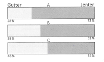

# DAT100: Java Programmering 3 - uke 37

## WARNING: Assignment under construction

### Oppgave 7

**Oppgave 18 Kap. 2 i Java-boken:** Denne oppgaven blir relevant for programmeringsprosjektet som kommer senere i faget.

Lag et program ved bruk av EasyGraphics som presenterer kjønnsfordeling i tre skoleklasser som delte linjediagram:



Andelen av gutter i A-klassen er 28 %, i B-klassen er den 38 % og i C klassen er den 46 %.

Fyll et rektangel som er 28 % av bredden til det grafiske vinduet med grønt og fortsett horisontalt mot høyre med at fyllt et rektangel med resten (72 %) av vindusbredden med rødt. Tegn et svart rektangel rundt de to fargefylte rektanglene. Gjenta slik uttegning for de to gjenstående klasser.

#### Oppgave 6 - Debugging

Som beskrevet i læreboken innebærer «Debugging» - eller feilfjerning – å kjøre et program steg for steg for å finne og fjerne feil. Utviklingsverktøy som Eclipse støtter dette og gjør det mulig bla. å inspisere tilstanden av programmet dvs. verdier av variable underveis.

I tillegg til feilfinning og feilfjerning kan stegvis utførsel også være nyttig for å forstå hvordan de ulike konstruksjoner i Java fungerer (semantikken).

Les først og gjør stegene:

https://github.com/dat100hib/dat100public/blob/master/eclipse/debugging.md

som gir en introduksjon til debugging i Eclipse.

Se på JAVA programmet nedenfor som har til oppgave å beregne volum av en boks utefra høyde, bredde og dybde.

Legg programmet inn i et Eclipse prosjekt og test ved å kjøre programmet om det gir riktig resultat. Prøv eks. med høyde 2, bredde 4 og dybde 8. Forventet resultat er 2 * 4 * 8 = 64.

Bruk debugging som beskrevet i oppgave a) ovenfor til å finne og rette feilen.

```java
import javax.swing.JOptionPane;

public class BoksVolum {

  public static void main(String[] args) {

    int b, h, d;
    String btext, htext, dtext;

    // les inn høyde, bredde, dybde
    htext = JOptionPane.showInputDialog("Angi høyde:");
    btext = JOptionPane.showInputDialog("Angi bredde:");
    dtext = JOptionPane.showInputDialog("Angi dybde:");

    // konverter fra tekst til heltal

    h = Integer.parseInt(htext);
    b = Integer.parseInt(btext);
    d = Integer.parseInt(htext);

    int volum = b * h * d;

    String respons =
        "Volum [" + htext + "," + btext + "," + dtext + "] = " + volum;

        JOptionPane.showMessageDialog(null, respons);
      }
}
```
